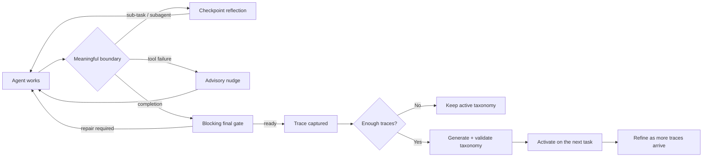

# 🧭 ATLAS

### A failure-mode taxonomy that watches an agent work, intervenes at meaningful checkpoints, and learns from its traces.

[](https://www.python.org/)
[](atlas_integration/claude_code/README.md)
[](atlas_runtime/)
[](finding/mast.json)
[](tests/)
[](LICENSE)

---

## ✨ What is ATLAS?

Agents often repeat the same *kinds* of mistakes: skipping verification, losing
track of requirements, persisting after a failed approach, or declaring success
too early.

ATLAS turns those recurring patterns into an active **failure-mode taxonomy**.
It begins with the general-purpose MAST taxonomy, observes the agent at
meaningful runtime boundaries, records the codes that actually fire, and can
generate a taxonomy specialized to the user's own traces.

> **The short version:** ATLAS gives an agent a structured way to notice its
> own mistakes before submission—without forcing a failure or an unnecessary
> edit.

### The interaction model

Every checkpoint follows the same two-perspective reflection:

1. **Observe → Map → Correlate** — inspect the recent trajectory like a neutral
   third-party reviewer and map only evidence-supported failure modes.
2. **Decide** — recognize that the trajectory is your own and change course
   only when necessary.

`none apply` is a valid result. ATLAS enforces that reflection happened in the
required shape; it cannot guarantee that the reflection is insightful.

---

## 🔄 How it works



| Stage | What happens |
|---|---|
| 🟦 **Start** | Resolve a stored taxonomy or begin with built-in MAST. |
| 🟨 **Runtime** | Surface taxonomy codes only when a checkpoint fires—never dump them into context at startup. |
| 🟥 **Gate** | Block completion until a valid reflection and final-gate decision exist. |
| 🟩 **Evidence** | Record fired codes, task IDs, reasoning, and evidence for the live dashboard. |
| 🟪 **Learning** | Capture one canonical trace and trigger generation or refinement at configured thresholds. |

---

## 🚀 Choose your path

| I want to… | Start here |
|---|---|
| Use ATLAS with **Claude Code** | [Claude Code quick start](#-claude-code-quick-start) |
| Wrap a **single LLM call** without a harness | [Single-LLM quick start](#-single-llm-quick-start) |
| Generate a taxonomy from **my existing traces** | [Import your own traces](#-bring-your-own-traces) |
| Pick a stored taxonomy interactively | [Taxonomy inheritance](#-taxonomy-inheritance) |
| Watch codes fire live | [Dashboard](#-live-dashboard) |
| Integrate another harness | [Pipeline integration guide](INTEGRATION.md) |

---

## 📦 Install

**Requirements:** Python 3.10 or newer.

### From the release branch

```bash
python -m pip install "git+https://github.com/multi-agent-systems-failure-taxonomy/ATLAS.git@ATLAS_SKILL"
```

### From a local checkout

```bash
python -m pip install .
```

### Anthropic support

```bash
python -m pip install "atlas-skill[anthropic] @ git+https://github.com/multi-agent-systems-failure-taxonomy/ATLAS.git@ATLAS_SKILL"
```

The installation provides:

| Command | Purpose |
|---|---|
| `atlas-claude-install` | Register project-local Claude Code hooks |
| `atlas-claude-uninstall` | Remove ATLAS hooks without disturbing unrelated settings |
| `atlas-claude-add-hook` / `remove-hook` / `list-hooks` | Bind the reflection<->refinement loop to **any** Claude Code event (e.g. `PreToolUse`) without writing Python — see [custom hooks](atlas_integration/claude_code/README.md#custom-hooks) |
| `atlas-single-run` | Run one no-harness model task through ATLAS |
| `atlas-import-traces` | **Generate** a stored taxonomy from existing traces (runs the full 8-step ATLAS pipeline) |
| `atlas-register-taxonomy` | **Register** a pre-generated taxonomy.json file as-is (no judging, no generation) |
| `atlas-find` | List, resolve, or interactively choose a taxonomy |
| `atlas-dashboard` | Open the live taxonomy dashboard |
| `atlas-doctor` | Check installation, writable storage, model recognition, credentials, and optional integrations |
| `atlas-traces` | Inspect, export, and conservatively prune stored trace files |

Most operational CLIs accept `--config path/to/atlas.json`. Explicit CLI
arguments override config-file values.

### Bringing your own taxonomy

If you already have a `taxonomy.json` from somewhere — a custom pipeline,
a sibling project, a hand-edited file, or an export from a different taxonomy
generator — you do NOT
need to re-run generation or re-judge traces to make it inheritable.
`atlas-register-taxonomy` ingests it as-is:

```bash
# One file
atlas-register-taxonomy --file path/to/taxonomy.json

# Batch: a directory of *.json
atlas-register-taxonomy --file path/to/folder-of-taxonomies/

# Pin a memorable id (default is auto-allocated tax-<stamp>-<digest>-<uuid>)
atlas-register-taxonomy --file my_tax.json --id my-curated-tax-v1

# Overwrite an existing id
atlas-register-taxonomy --file updated.json --id my-curated-tax-v1 --replace
```

Accepts both atlas_skill's flat schema (`{repo, domain, codes: [...]}`)
and the ATLAS pipeline output (`{annotation_layer, full_layer, ...}`).
After registration the id shows up in `atlas-find --list` and can be
passed to `--inherit` on any install or single-run command.

If you DO want the Reflection Judge + refiner to clean up your imported
taxonomy against a trace pool, add `--traces` and `--atlas-model` — but
those are optional. The default path is "register the file, that's it."

> 🔐 **Credentials are never written into ATLAS configuration.** OpenAI-compatible
> calls use `OPENAI_API_KEY`; Anthropic uses its SDK environment credentials;
> Gemini uses `GEMINI_API_KEY` or `GOOGLE_API_KEY`.

---

## 🟠 Claude Code quick start

Install ATLAS into one project:

```powershell
atlas-claude-install `
  --project-dir C:\path\to\project `
  --trace-output C:\path\to\atlas-program `
  --atlas-model claude-sonnet-4-6
```

```bash
atlas-claude-install \
  --project-dir /path/to/project \
  --trace-output /path/to/atlas-program \
  --atlas-model claude-sonnet-4-6
```

Optional preflight:

```bash
atlas-doctor \
  --trace-output /path/to/atlas-program \
  --atlas-model claude-sonnet-4-6 \
  --claude-code \
  --dashboard-port 8765
```

Warnings mean "ATLAS can still run, but you may be missing something useful"
such as a provider API key. Errors mean the install or requested integration
is not ready.

That's enough to get started. For the **full hook event list, repair-loop
semantics, Claude binary discovery, OpenAI-compatible learning endpoints,
Bedrock learning model setup, uninstall + legacy-migration flags, and the
`--skip-judge` behavior** — see the integration README, which is the
single source of truth for install options:

➡ **[`atlas_integration/claude_code/README.md`](atlas_integration/claude_code/README.md)**

---

## 🔵 Single-LLM quick start

Use this path when your application owns the model call and there is no agent
harness.

### Command line

```powershell
$env:OPENAI_API_KEY = "..."

atlas-single-run `
  --task "Review this implementation and return the corrected result." `
  --model gpt-5 `
  --trace-output C:\path\to\atlas-program
```

Or provide a task file:

```bash
atlas-single-run \
  --task-file task.md \
  --model gpt-5 \
  --trace-output ./atlas-program
```

### Python callback API

```python
from atlas_integration.single_llm import SingleLLMConfig, run_single_llm


def my_message_callback(messages: list[dict[str, str]]) -> str:
    # Send the full message list to your provider and return assistant text.
    ...


result = run_single_llm(
    "Solve the task.",
    my_message_callback,
    SingleLLMConfig(
        trace_output="run/program",
        trace_root="run/traces",
        atlas_model="gpt-5",
    ),
)

print(result.answer)
```

The adapter pauses when the model requests a major-segment checkpoint, injects
the active taxonomy, validates the reflection, enforces the final gate, records
live firing evidence, captures the conversation, and closes the normal learning
lifecycle.

---

## 🧬 Taxonomy inheritance

Taxonomies are selected only by `taxonomy_id`. Repository and domain fields are
display metadata—not routing keys.

All supported CLIs use the same selection forms:

| Invocation | Result |
|---|---|
| Omit `--inherit` | Fresh program starts with built-in MAST |
| `--inherit <taxonomy_id>` | Use that stored taxonomy |
| `--inherit-pick` | Open the local visual taxonomy picker |

Bare `--inherit` still opens the picker for compatibility, but it is
deprecated because it is easy to confuse with an accidental missing id.

Example:

```bash
atlas-single-run \
  --task "Fix the failing test" \
  --model gpt-5 \
  --trace-output ./program \
  --inherit tax-20260619-example
```

The selected taxonomy is fixed for the current task. A newly generated or
refined successor becomes visible only to a later task.

---

## 📥 Bring your own traces

Generate and store an inheritable taxonomy whenever you already have traces:

```powershell
atlas-import-traces `
  --traces C:\path\to\trace-file-or-directory `
  --atlas-model gpt-5 `
  --repo my-project
```

The command:

1. Normalizes supported traces into the canonical schema.
2. Runs the vendored upstream ATLAS eight-stage generator.
3. Runs Reflection-Judge refinement by default.
4. Allocates an ID only after structural acceptance.
5. Transactionally stores the taxonomy, traces, and generation artifacts.
6. Leaves the taxonomy dormant until selected with `--inherit`.

Rejected imports create no taxonomy record or taxonomy trace folder.

### Recommended trace format

Use one object per line in a `.jsonl` file:

```json
{
  "problem_id": "stable-task-or-attempt-id",
  "task": "task prompt or objective",
  "raw_trajectory": "plain-text execution trajectory",
  "metadata": {}
}
```

Also supported: canonical JSON, tau-bench, Codex sessions, event logs,
conversation/Forgecode records, KIRA trajectories, and directly supplied
plain-text trajectory files. Directories are scanned recursively for JSON and
JSONL files.

---

## 📊 Live dashboard

ATLAS can launch a local read-only dashboard automatically with the first task.
It updates as checkpoint evidence arrives and follows taxonomy successors
without restarting.

Run it manually:

```bash
atlas-dashboard \
  --trace-output ./atlas-program \
  --store-dir ~/.atlas-skill/taxonomies
```

The dashboard shows:

- the active taxonomy and latest successor;
- code descriptions and categories;
- total firings and unique task IDs;
- firings per task;
- checkpoint reasoning and evidence;
- taxonomy-version-scoped counts.

It binds to localhost and opens `http://127.0.0.1:8765/` by default. Use
`--port 0` for any free port or `--no-browser` to suppress browser launch.

---

## 🧠 Learning lifecycle

ATLAS separates **runtime interaction** from **taxonomy learning**.

### Fresh start: MAST → generated taxonomy

```text
Task traces:  1 ── 2 ── 3 ── 4 ── 5
                                  │
                                  ▼
                         Generate candidate
                                  │
                                  ▼
                 Reflection Judge + refiner
                           │
                           ▼
                  structural validation
                           │
                           ▼
                    activate later
```

- Default generation threshold: **N = 5** traces.
- Success and failure traces count equally.
- Generation input is outcome-blind.
- By default, the generated candidate passes through the Reflection Judge and
  refiner before registration.
- `--skip-judge` accepts the generated candidate on structural validity alone.
- A structurally invalid or explicitly rejected candidate receives no
  taxonomy ID; pending traces stay in the program folder.
- Activation waits until no task is running.

### Refinement

| Phase | Default | Meaning |
|---|---:|---|
| Initial refinement | `K_init = 10` | First refinement after a program begins using a real taxonomy |
| Standard refinement | `K = 20` | Later refinements since the program's previous accepted refinement |

Refinement creates a new taxonomy ID and a successor link—it never overwrites
the previous taxonomy. Other programs follow the successor on their next task
while preserving their own counters.

<details>
<summary><strong>Generation and validation details</strong></summary>

- The vendored ATLAS pipeline induces a candidate taxonomy from the frozen
  generation trace set.
- The Reflection Judge analyzes the same trace set for concrete failure
  points and taxonomy mappings.
- The refiner applies add / edit / split / retire mutations to sharpen the
  candidate before it is registered.
- Judge and refiner calls use bounded JSON repair retry.
- A rejected candidate receives no ID and does not consume pending traces.
- After structural rejection or explicit approver rejection, generation retries
  after another `N` traces arrive.

</details>

<details>
<summary><strong>Basic vs. advanced refinement</strong></summary>

Basic refinement:

```text
current taxonomy + frozen trace set
        ↓
replacement candidate
        ↓
structural validation + diff
        ↓
accepted successor
```

With `--advanced-refinement`, ATLAS adds one support-judge pass. Reported
issues receive one repair-model call; the repaired candidate is not judged a
second time.

</details>

---

## 🎛️ Configuration

Use `atlas.json` when you want repeatable installs or several commands sharing
the same paths/model:

```json
{
  "version": 1,
  "trace_output": "./atlas-program",
  "atlas_model": "gpt-5",
  "store_dir": "~/.atlas-skill/taxonomies",
  "trace_root": "~/.atlas-skill/traces",
  "inherit": null,
  "generation_threshold": 5,
  "generation_stops": false,
  "skip_judge": false,
  "k_init": 10,
  "k": 20,
  "refinement_stops": false,
  "advanced_refinement": false,
  "max_retries": 3,
  "dashboard": true,
  "built_in_hooks": {
    "SubagentStop": false,
    "PostToolUse": {
      "enabled": true,
      "matchers": ["Bash", "Edit", "Write"]
    },
    "PostToolUseFailure": ["Bash"]
  }
}
```

Supported shared fields include `trace_output`, `atlas_model`, `store_dir`,
`trace_root`, `inherit`, `repo`, `repo_path`, `generation_threshold`,
`generation_stops`, `skip_judge`, `k_init`, `k`, `refinement_stops`,
`advanced_refinement`, `max_retries`, `dashboard`, `openai_base_url`,
`openai_api_key_env`, `built_in_hooks`, and the single-LLM task `model`.

Relative paths are resolved relative to the config file. Unknown fields are
rejected so typos do not silently change a run. These commands currently read
`--config`: `atlas-claude-install`, `atlas-single-run`,
`atlas-import-traces`, `atlas-register-taxonomy`, `atlas-doctor`, and
`atlas-traces`.

Claude Code also exposes the main lifecycle controls directly:

| Option | Default | Effect |
|---|---:|---|
| `--generation-threshold` | `5` | Traces required before initial generation |
| `--generation-stops` | off | Block the threshold-crossing task while generation runs |
| `--skip-judge` | off | Skip Reflection Judge + refiner at end of generation (default: refine before accept) |
| `--k-init` | `10` | Traces before a program's first refinement |
| `--k` | `20` | Traces between later refinements |
| `--refinement-stops` | off | Block while refinement runs |
| `--advanced-refinement` | off | Add judge-guided refinement repair |
| `--max-retries` | `3` | Completed final-gate repair opportunities before honest unresolved release |
| `--failure-throttle-calls` | `5` | Minimum tool calls between reactive nudges |
| `--failure-recency-seconds` | `30` | Time-based duplicate-nudge suppression |
| `--disable-hook` | none | Do not install a built-in Claude Code hook event, e.g. `SubagentStop` |
| `--post-tool-use-matchers` | `*` | Restrict successful-tool nudges to selected Claude Code tool matchers |
| `--post-tool-use-failure-matchers` | `*` | Restrict failed-tool nudges to selected Claude Code tool matchers |
| `--no-dashboard` | off | Let an outer application own dashboard lifecycle |

### Storage

Default writable locations:

```text
~/.atlas-skill/
├── taxonomies/
└── traces/
```

Override them with:

| Variable | Purpose |
|---|---|
| `ATLAS_HOME` | Change the shared ATLAS data root |
| `ATLAS_STORE_DIR` | Override only the taxonomy store |
| `ATLAS_TRACE_ROOT` | Override only the learning-trace store |
| `ATLAS_DISABLE_DASHBOARD=1` | Disable automatic dashboard launch |

Explicit CLI and API paths always take precedence.

---

## 🔌 Public runtime API

Custom harnesses can use the engine directly. For ownership boundaries,
configuration, trace-output semantics, and a fuller adapter checklist, see
[`INTEGRATION.md`](INTEGRATION.md).

```python
from atlas_runtime import (
    GenerationTrace,
    end_session,
    pre_submission,
    record_trace,
    start_session,
)

session = start_session(
    trace_output="./program",
    atlas_model="gpt-5",
)

# Deliver session.delivery.runtime_protocol and, only at a checkpoint,
# the relevant session.delivery.taxonomy content.

decision = pre_submission(session, model_gate_text)

record_trace(
    session,
    GenerationTrace(
        problem_id="task-001",
        task="Fix the parser",
        raw_trajectory=complete_trace,
        metadata={"harness": "custom"},
    ),
)

result = end_session(session)
```

The engine owns taxonomy selection, persistence, generation, validation,
refinement, lineage, and dashboard lifecycle. The harness owns prompt delivery,
model execution, and trace collection.

---

## 🛡️ What ATLAS enforces—and what it cannot

| Claim | Reality |
|---|---|
| Reflection ran | ✅ Shape is machine-checked |
| At least one code has evidence, or `none apply` is justified | ✅ Machine-checked |
| Each repair receives a fresh reflection and the completed-repair limit is respected | ✅ Machine-checked |
| Claude Code completion can be blocked | ✅ Through blocking hooks |
| Reactive tool-failure nudge is mandatory | ❌ Advisory only |
| Reflection is genuinely insightful | ❌ Content quality is not mechanically knowable |
| A fired code proves the task answer is wrong | ❌ It identifies a process pattern, not benchmark correctness |

The static [`SKILL.md`](SKILL.md) contains only standing interaction behavior.
The active taxonomy is deliberately **not** always loaded into context; it is
surfaced at runtime checkpoints.

---

## 🗂️ Data model

```json
{
  "taxonomy_id": "tax-20260619-example",
  "repo": "display-only/repository",
  "domain": "Discovered domain",
  "codes": [
    {
      "id": "A.1",
      "name": "Failure name",
      "description": "Observable definition",
      "category": "A"
    }
  ]
}
```

- `taxonomy_id` is the only selector.
- `repo` and `domain` are display-only metadata.
- MAST is a built-in floor, not a stored picker record.
- Generated and refined taxonomies are immutable records connected by
  successor links.

---

## 🧪 Verification

```bash
python -m pytest -q
```

The current release includes **269 passing tests** covering:

- taxonomy finding and interactive selection;
- MAST fallback and canonical schema;
- Claude Code hook contracts and retry guards;
- zero-tool, sub-task, subagent, failure-nudge, and final-gate paths;
- live evidence and dashboard updates;
- trace capture and outcome-blind learning;
- generation, validation, retry, activation, and lineage;
- basic and advanced refinement;
- imported-trace taxonomy generation;
- install/uninstall behavior and writable storage defaults;
- direct single-LLM checkpoints and repairs.
- install health checks, trace management, trace redaction helpers, and
  shared `atlas.json` config support.

---

## 🧹 Uninstall and data

Remove Claude Code hooks:

```bash
atlas-claude-uninstall --project-dir /path/to/project
```

ATLAS does not automatically delete learned taxonomies or traces. User data
remains under `~/.atlas-skill/` unless custom paths were supplied.

Trace retention is intentionally conservative: data is not expired
automatically. ATLAS warns when a trace folder exceeds 10,000 records or its
oldest file is more than 90 days old.

Use `atlas-traces` to inspect or manage trace growth:

```bash
# Show all taxonomy trace folders, plus one program's pending folder
atlas-traces status \
  --trace-root ~/.atlas-skill/traces \
  --trace-output ./atlas-program

# Export one taxonomy trace folder as JSONL
atlas-traces export \
  --taxonomy-id tax-20260624T203104Z-7cf91f62-56ac5e \
  --output traces.jsonl

# Dry-run prune first; add --yes only when the matched paths look right
atlas-traces prune \
  --older-than-days 90 \
  --taxonomy-id tax-20260624T203104Z-7cf91f62-56ac5e
atlas-traces prune \
  --older-than-days 90 \
  --taxonomy-id tax-20260624T203104Z-7cf91f62-56ac5e \
  --yes
```

Pruning only considers files named `trace-*.json` inside selected trace
collections. It does not delete manifests, taxonomy records, locks, dashboard
state, or generation artifacts.

---

## 📚 Repository map

Every folder below has its own `README.md` that lists what each file in
it does and what each sub-folder is for.

| Path | Purpose |
|---|---|
| [`atlas_runtime/`](atlas_runtime/README.md) | Harness-neutral lifecycle, generation, refinement, LLM transports, dashboard |
| [`atlas_integration/`](atlas_integration/README.md) | Harness-specific skins (Claude Code, single-LLM) on top of the runtime |
| [`atlas_integration/claude_code/`](atlas_integration/claude_code/README.md) | Claude Code runtime skin (dispatcher + hooks + transcript + state) |
| [`atlas_integration/claude_code/hooks/`](atlas_integration/claude_code/hooks/README.md) | One file per Claude Code hook event |
| [`atlas_integration/single_llm/`](atlas_integration/single_llm/README.md) | No-harness single-LLM adapter |
| [`finding/`](finding/README.md) | Taxonomy store, MAST loader, `--inherit` resolver, web picker |
| [`judge_types/`](judge_types/README.md) | The 7 taxonomy-aware judge types (Selection, Reflection, Mapping, Coverage, Quality, Calibration, Selection-Summary) |
| [`judge_types/reflection_judge/`](judge_types/reflection_judge/README.md) | The deep multi-stage Reflection Judge |
| [`examples/`](examples/README.md) | Runnable demonstration scripts |
| [`vendor/`](vendor/README.md) | Third-party code vendored into the package |
| [`vendor/atlas/`](vendor/atlas/README.md) | Vendored upstream ATLAS taxonomy-induction library |
| [`vendor/atlas/pipeline/`](vendor/atlas/pipeline/README.md) | The 8-step ATLAS generation pipeline |
| [`vendor/atlas/traces/`](vendor/atlas/traces/README.md) | Trace loading, normalization, signal extraction |
| [`tests/`](tests/README.md) | Unit + integration test suite |

---

<div align="center">

### Start general. Observe honestly. Learn the failures that actually recur.

`MAST → runtime evidence → generated taxonomy → refinement`

</div>
